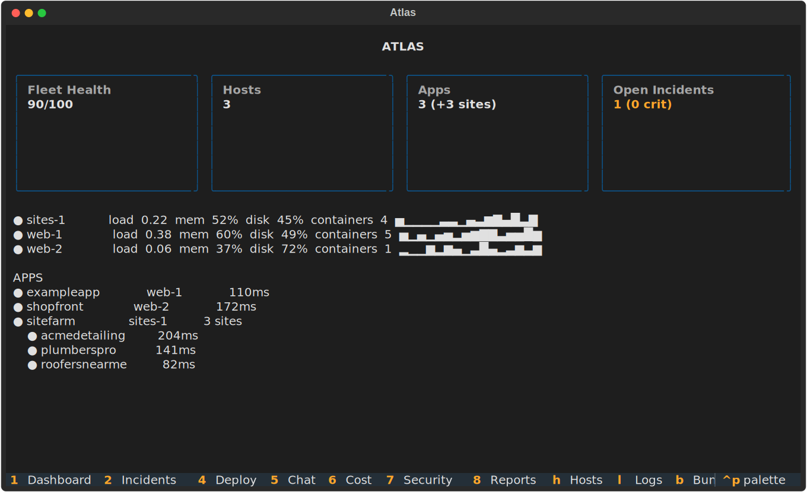
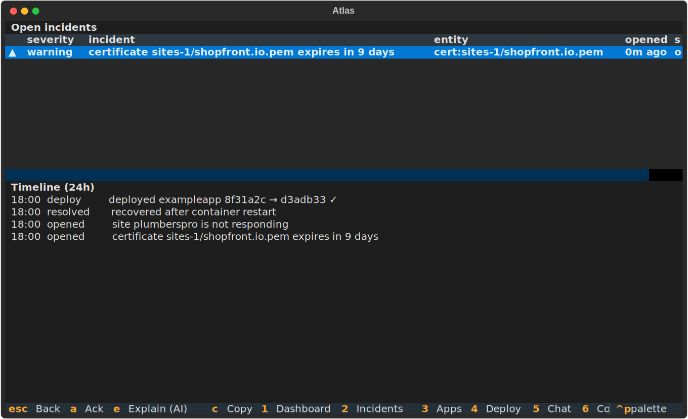
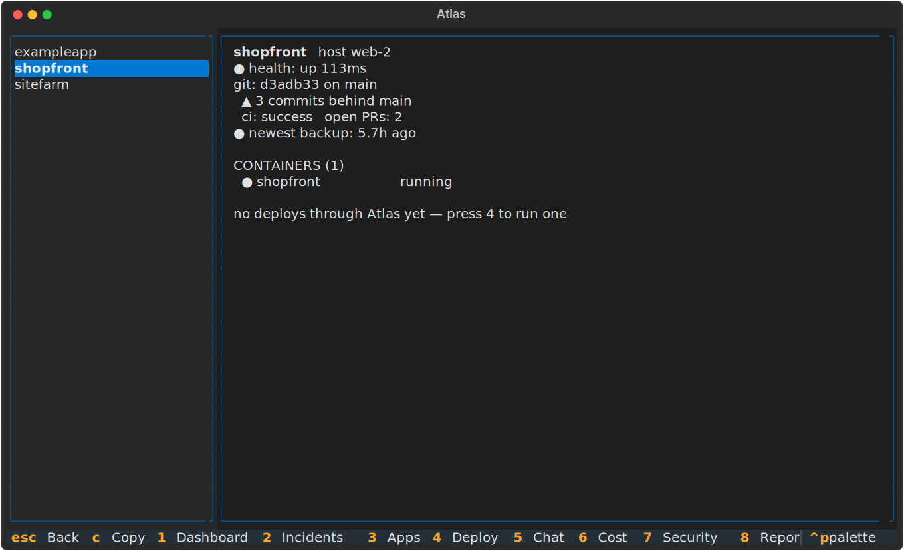
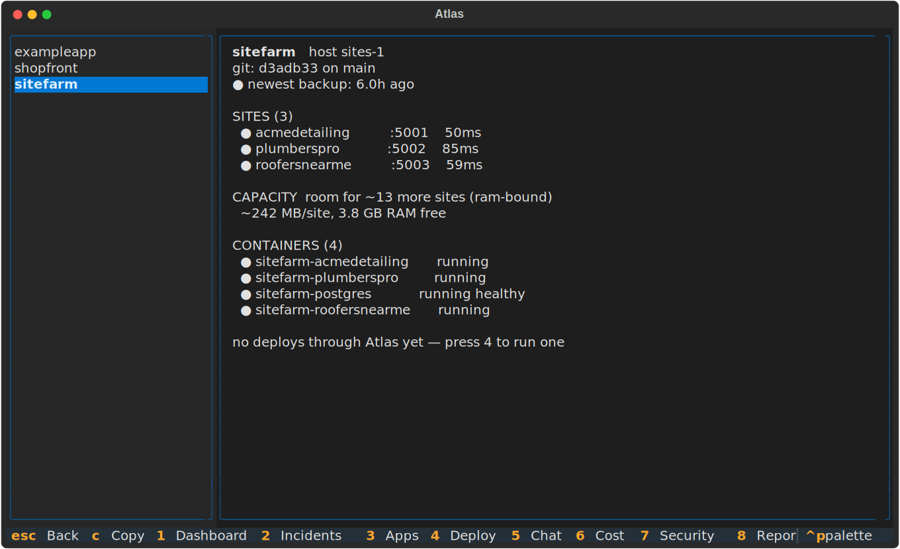
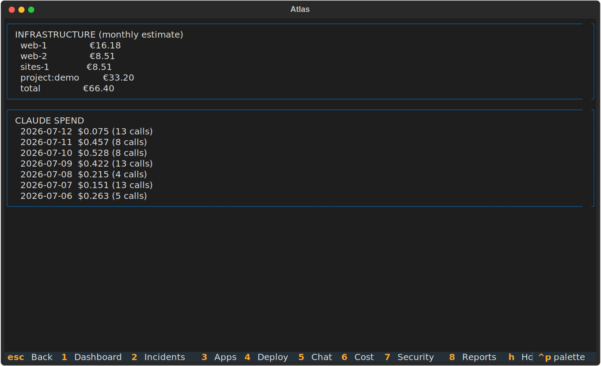
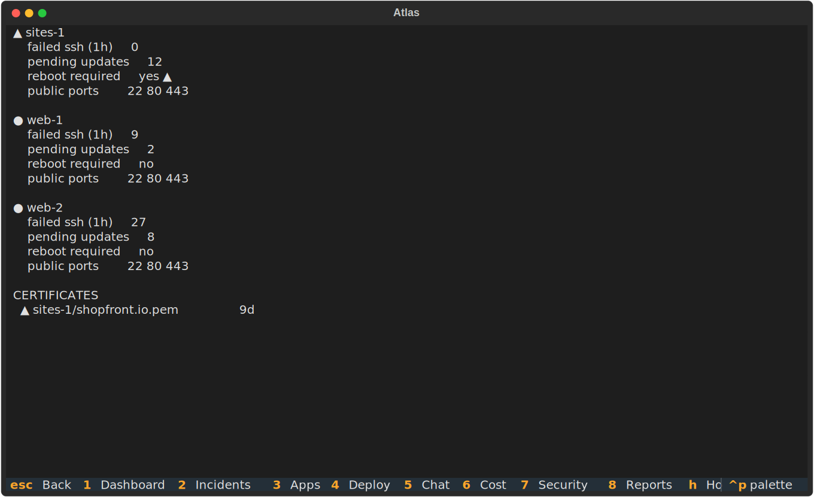
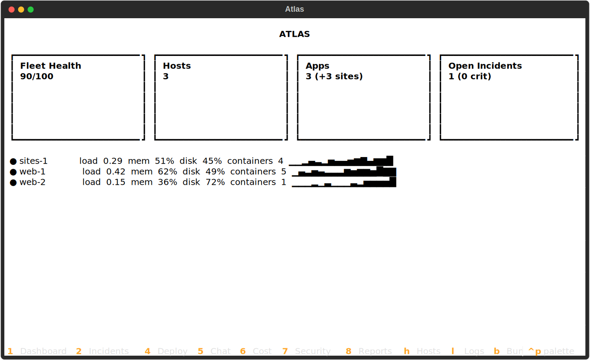

# Atlas

[](https://github.com/dcblack87/Atlas/actions/workflows/ci.yml)


**An AI-native operations platform for self-hosted infrastructure.**

Grafana + Datadog + PagerDuty + Claude, rebuilt for one developer, one
Hetzner bill, and an e-ink tablet.


Atlas is a terminal operations centre that runs 24/7 in tmux on one of your
own servers. It discovers your fleet automatically (hosts, containers,
sites, vhosts, certs, crons, backups), watches it, explains problems with
Claude, pushes deploys behind a typed confirmation, and pages you on
Telegram only when something is genuinely on fire.

## Why

Traditional observability stacks assume a team, a budget, and a wall of
monitors. A solo founder running real products on a few VPSes needs
something else entirely:

- **One process, one SQLite file, zero agents.** Atlas is agentless: it
  observes over SSH (via your tailnet) and local subprocess. Nothing to
  install on the machines it watches.
- **AI that interprets, not decorates.** Atlas doesn't say "disk 84%". It
  says *"disk grew 14 GB this week, almost entirely Docker build cache from
  your Next.js deploys; `docker builder prune` recovers ~18 GB"*, with a
  hard daily API budget enforced in code.
- **Designed for e-ink.** Atlas runs beautifully in any terminal, but it's
  built to live on a low-power e-ink tablet as an always-on physical ops
  cockpit: change-driven rendering, coalesced updates, zero animation,
  glyphs instead of colour. MacBook for development, e-ink for operations,
  phone for emergencies.
- **Read-only by default.** Exactly one module can mutate your servers, the
  deploy orchestrator, and it sits behind a typed confirmation, an
  allowlist, and an audit trail. Atlas never needs your cloud credentials
  for anything but read-only billing queries.

## Quickstart

```bash
git clone https://github.com/dcblack87/Atlas && cd Atlas
uv sync

# see it immediately: fixture fleet, no SSH, no secrets
uv run atlas run --demo

# then wire up your own fleet:
cp atlas.example.toml atlas.toml && $EDITOR atlas.toml
uv run atlas check
uv run atlas run
```

For the always-on installation (tmux on a server, attach from anything on
your tailnet) see [docs/running.md](docs/running.md). For the e-ink and
phone clients (BOOX, reMarkable, Supernote, iOS, Android) see
[docs/device-setup.md](docs/device-setup.md).

## The tour

**The dashboard** answers the three questions that matter in one glance: is
anything down, is anything about to be, and is there anything to ship. When
origin/main is ahead of what's deployed, the Deploys tile turns amber and
the app's row says so; press `4` and the deploy is one typed confirmation
away.



**Incidents** come from a declarative rule table with hysteresis (no
flapping), auto-resolve, and health scores. The timeline interleaves
deploys and inventory drift with incidents, because "what changed?" is
always the first question. Telegram pages you for critical only.



**Apps** is the per-app drill-down: liveness, git state vs origin, CI and
open PRs beside the infra they'll land on, containers, backups, deploy
history.



Multi-tenant apps get per-site health and a capacity estimate grounded in
real container memory, so "can I onboard another customer on this box?" has
a number.



**Cost** shows real monthly figures from the Hetzner Cloud API (read-only
token) next to what Claude has spent, day by day, against its budget.



**Security** tracks pending updates, reboot flags, exposed ports, failed
SSH attempts, and certificate expiry across the fleet.



**Display profiles** (`F2`, or `p` on tablet keyboards) retune the whole UI
for the glass it's on: `standard` for LCD, `eink` for greyscale with slow
coalesced refresh, `glance` for huge tiles readable across a desk.



## What's inside

- **Zero-config discovery**: hosts, containers, multi-tenant sites (from
  `sites/*/.port`), nginx vhosts, certs, crons, backups, git state. Add a
  site to your server and it's on the dashboard within one cycle.
- **Audited deploys**: preflight sha comparison, a typed-confirmation gate,
  streamed output, hard timeout, post-deploy verification of every
  container and endpoint (every *site* for multi-tenant apps), guided
  rollback, and a full audit trail. One fleet-wide mutation lock.
- **Deploy drift on the dashboard**: deployed sha vs origin/main via the
  GitHub API. A pending deploy is a tile on the front screen, not a fact
  you discover by SSHing in.
- **AI that pays its own way**: a hard daily budget enforced *before* every
  call, spend recorded from actual API usage, prompt caching, per-entity
  cooldowns. Incident explanations (`e`), host summaries (`E`), streaming
  chat (`5`) grounded in live SQL. No vector DB.
- **It learns your normal**: 4-week hour-of-week baselines detect anomalies
  ("RAM is 4.5× its norm, began 20 min after deploy 8f31a2") and
  least-squares forecasting warns *before* the disk fills ("full in ~14
  days").
- **Briefs**: a deterministic morning/weekly status skeleton with an
  optional AI narrative on top. Budget exhausted? The skeleton ships anyway.

## Security model

- **Read-only by default.** Exactly one module (`atlas/deploy/`) can
  construct a mutating command. That invariant is enforced by a test in CI,
  not a convention.
- **Every mutation is gated**: typed confirmation phrase (stored in the
  audit row), allowlisted remediation templates, sanitised parameters,
  fleet-wide lock, hard timeout.
- **No cloud credentials needed** beyond read-only billing tokens. SSH uses
  a dedicated key over your tailnet with trust-on-first-use host pinning.
- **Secrets never reach git**: real inventory lives in a gitignored
  `atlas.toml`, CI runs gitleaks, and AI context bundles scrub credentials,
  URL passwords, and high-entropy tokens.

## Design

See [docs/architecture.md](docs/architecture.md). The short version:

```
Transport (local subprocess | pooled SSH)
   → Collectors (async loops, per-collector cadence)
      → SQLite (inventory · metrics · incidents · audit)
         → Decision engine (rules → incidents · health · forecasts)
            → Textual TUI · Telegram · Claude
```

Strict layering: collectors never touch the UI, the UI never runs commands,
and everything meets at the store. The AI layer reads the same SQLite
everything else does. SQL is the retrieval engine; there is no vector
database because there doesn't need to be one.

More docs: [the deploy model](docs/deploy-model.md) ·
[writing a collector](docs/collectors.md) ·
[running Atlas](docs/running.md) ·
[device setup](docs/device-setup.md)

## Milestones

- [x] **M0**: skeleton (config, TUI shell, display profiles)
- [x] **M1**: fleet visibility (SSH/local collectors, discovery, live dashboard)
- [x] **M2**: incidents (rules engine, health scores, Telegram alerts, demo mode)
- [x] **M3**: deploys (audited push-button deploys with post-deploy verification)
- [x] **M4**: AI (budget-capped insights, incident explanation, grounded chat, context bundles)
- [x] **M5**: intelligence (baselines and anomaly detection, forecasting, deploy drift, costs, security audit, briefs)

## License

MIT
